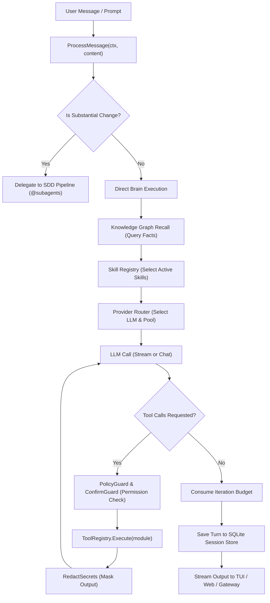
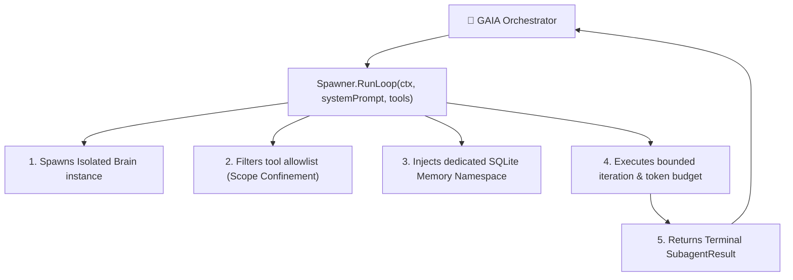
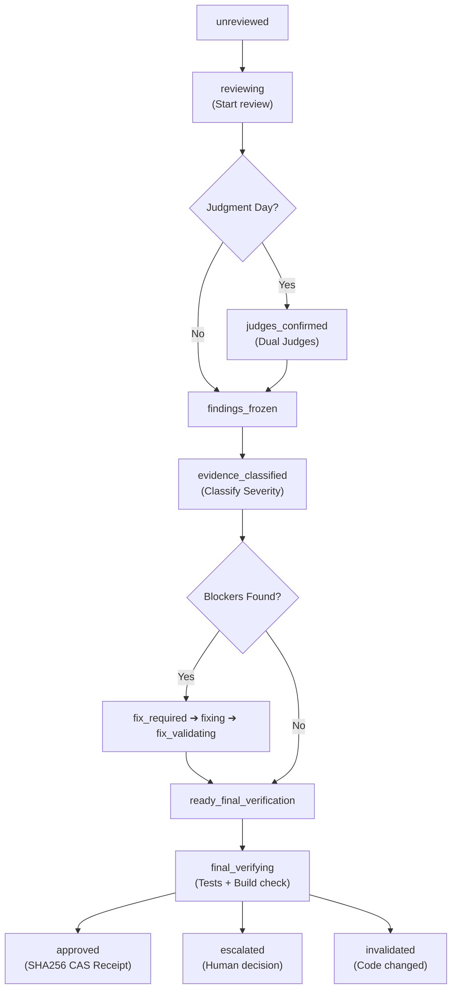
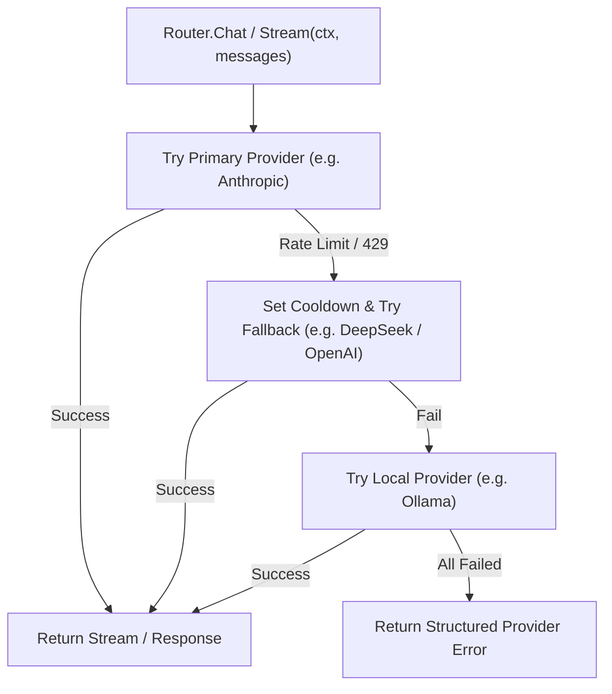
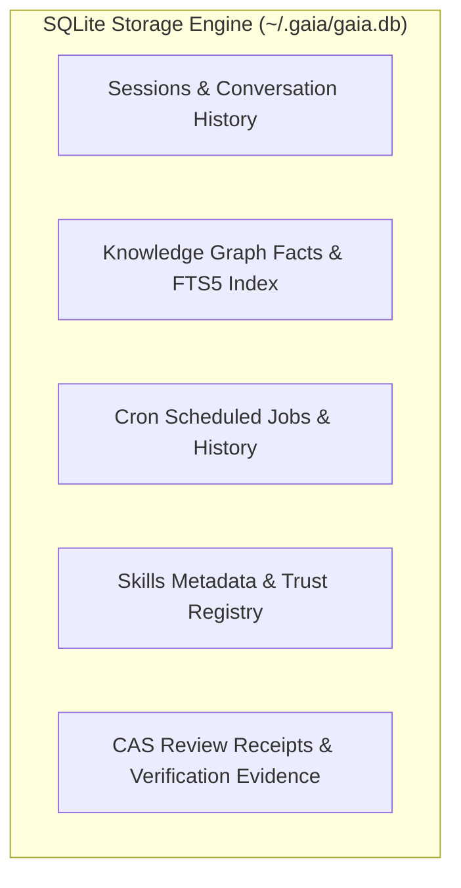

# Architecture

GAIA follows a **hexagonal (ports & adapters) architecture** written in Go. The core is framework-agnostic, with all integrations behind interface boundaries.

---

## Package Layout

```text
gaia/
├── cmd/gaia/                 # CLI entry points (main, exec, review, cron, gateway, etc.)
├── internal/
│   ├── agent/                # Subagent system (spawner, registry, sdd, ops, learn)
│   ├── core/                 # Core domain (domain, ports, kernel, policyguard, registry)
│   ├── modules/              # Tool modules (shell, fileops, gitops, security)
│   ├── review/               # BR review engine (engine, states, lenses, CAS store)
│   ├── skills/               # Skills Hub (registry, downloader, tap, AST audit)
│   ├── cron/                 # Cron scheduler & delivery targets
│   ├── mcp/                  # MCP client (JSON-RPC stdio & SSE)
│   ├── gateway/              # Multi-platform messaging gateway (Telegram, Discord, Slack)
│   ├── webhook/              # Webhook listener (HTTP + HMAC-SHA256)
│   ├── lsp/                  # LSP client & diagnostics parser
│   ├── plugins/              # Plugin loader and manager
│   ├── browser/              # Headless browser MCP plugin
│   ├── doctor/               # System diagnostics and self-healing
│   └── config/               # YAML configuration loader & saver
├── internal/adapters/        # Infrastructure Adapters
│   ├── llm/                  # 19 LLM providers router & credential pool
│   ├── tui/                  # Cyberpunk Bubbletea TUI
│   ├── desktop/              # Wails Desktop UI
│   ├── db/                   # SQLite persistence & migrations
│   └── output/               # JSON/text output formatters
├── docs/                     # 18 official documentation guides
└── Makefile
```

---

## The Agent Loop (Brain)

`internal/core/kernel.go` — The Brain is the heart of GAIA:



---

## Subagent System

`internal/agent/` — Each subagent is an autonomous LLM-powered worker with its own memory namespace:



---

## Review State Machine

`internal/review/state.go` — 13 states with content-bound SHA256 receipts:



---

## LLM Provider Router & Failover

`internal/adapters/llm/router.go` — Manages 19 providers with automatic failover and rate-limit cooldown:



Each provider adapter implements:
- `Chat(ctx, messages) → (*Message, error)`
- `Stream(ctx, messages) → (<-chan TokenChunk, error)`
- `Tools() → []ToolDef`

---

## Persistence & Storage


