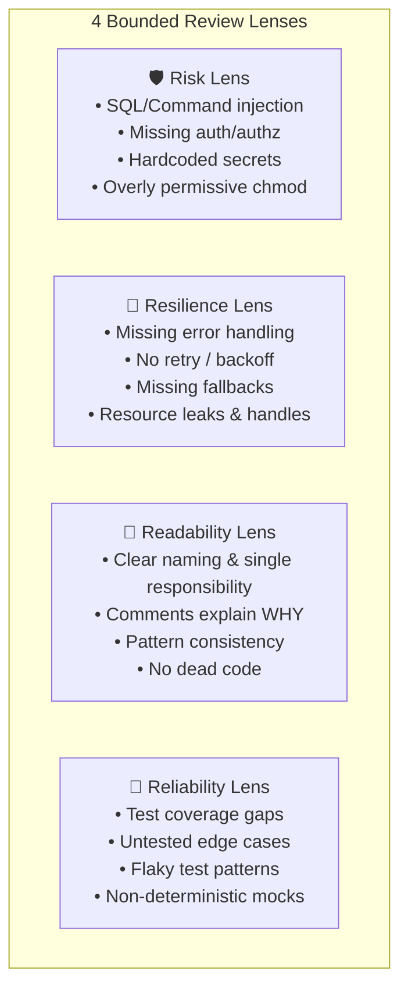
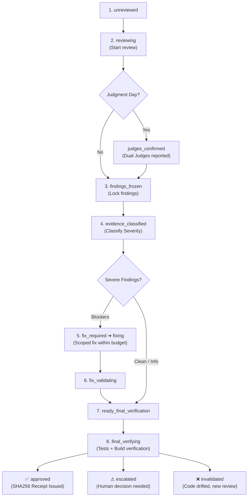

# Code Review System

GAIA includes a built-in bounded code review system inspired by Gentle-AI's BR (Gentleman Guardian Angel) and extended with Judgment Day for adversarial review.

---

## Overview

```bash
gaia review start                     # Start a review
gaia review start --judgment-day      # Adversarial review
gaia review status                    # Check review state
gaia review validate                  # Validate receipt
gaia review list                      # List recent reviews
gaia review install-hooks             # Install git hooks
gaia review mode enable --scope clone # Enable opt-in review for this clone
gaia review mode disable              # Disable review mode
```

### Opt-In Review Mode Switch

Receipt-Driven Development (RDD) review is **opt-in and disabled by default**:
- When **disabled**, delivery gates pass under ordinary repository policy without requiring a review receipt.
- When **enabled**, gates enforce content-bound receipts (`post-apply → pre-commit → pre-push → pre-PR → release`).
- Scope can be configured per repository clone (`--scope clone`) or globally across the user machine (`--scope global`).

### Correction Line Budget

When review findings require surgical fixes:
- The correction budget is capped mathematically: `min(200, ceil(original_changed_lines / 2))`.
- Ordinary review permits at most **1 correction transaction**.
- Excess line modifications or failed corrections trigger escalation to human review.

### Content-Addressable Receipt Authority (Git CAS & Fallback)

Receipts generated during code reviews are managed by `CASReceiptStore` (`internal/review/gates/cas_store.go`):
- **Git Repositories (Native CAS)**: Receipts are written directly into Git's Object Database as immutable blobs (`git hash-object -w --stdin`) and referenced atomically at `refs/gaia-reviews/<change-name>`.
- **Non-Git Workspaces (Graceful Fallback)**: If a project is not version-controlled with Git, receipts fall back automatically to standard filesystem JSON storage in `.gaia/reviews/` without throwing errors.
- **Delivery Gates Validation**: Delivery gates (`pre-commit`, `pre-push`, `pre-pr`) inspect `CASReceiptStore` to ensure that the current workspace tree matches the exact SHA-256 hash of the approved review.

---

## Risk Classification

The engine classifies each change using 8 risk codes:

| Risk Code | Meaning | Triggers |
|---|---|---|
| `configuration_change` | Config file changes | YAML, JSON, TOML, env files |
| `executable_change` | Binary output changes | Build outputs, compiled files |
| `executable_mode` | Permission changes | File mode bits (+x) |
| `hot_path` | Auth/security/payments | Routes with auth middleware |
| `large_change` | Many changed lines | >400 changed lines |
| `non_executable_only` | Docs/comments only | Only markdown, comments, formatting |
| `service_token` | Credential changes | New API keys, tokens in code |
| `shell_source` | Subprocess changes | Shell scripts, Makefile, subprocess calls |

Risk level is determined by combining codes:

| Risk Level | Condition | Lenses |
|---|---|---|
| **Low** | Only `non_executable_only` | No lens needed (auto-approve) |
| **Medium** | Any other single reason | 1 dominant lens |
| **High** | `hot_path` OR `large_change` OR `service_token` OR `shell_source` | All 4 lenses |

---

## The 4 Review Lenses



---

## Review State Machine

A review progresses through formal states:



---

## Receipt Structure

```json
{
  "schema": "gaia.review-receipt/v1",
  "lineage_id": "sha256:abc123...",
  "snapshot_hash": "sha256:def456...",
  "selected_lenses": ["review-risk", "review-readability"],
  "risk_level": "medium",
  "risk_reasons": ["configuration_change"],
  "correction_budget": 85,
  "correction_used": 0,
  "state": "approved",
  "findings": [
    {
      "severity": "WARNING",
      "lens": "review-risk",
      "file": "src/config.js",
      "line": 42,
      "message": "API key hardcoded — use environment variable"
    }
  ],
  "final_verification_hash": "sha256:789ghi..."
}
```

---

## Delivery Gates

| Gate | Timing | Checks | Action on Fail |
|---|---|---|---|
| `post-apply` | After task completion | Lint + build + basic tests | Fix before continuing |
| `pre-commit` | Git `pre-commit` hook | Receipt valid + tree hash matches | Block commit |
| `pre-push` | Git `pre-push` hook | Receipt valid for HEAD | Block push |
| `pre-pr` | Before PR creation | Full review completed + receipt | Require review |
| `release` | Before release build | Zero unresolved blockers | Block release |
