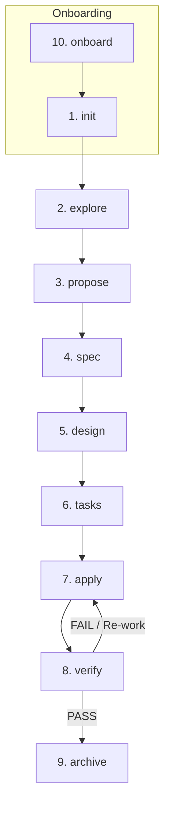

# Spec-Driven Development (SDD) Workflow

SDD is the structured planning layer for substantial changes in GAIA. It transforms vague requests into tested, reviewed, and archived deliverables — with each phase handled by specialized subagent capabilities that learn from experience.

---

## When to Use SDD

| Use SDD | Don't use SDD |
|---|---|
| New features | Quick questions |
| API changes | Simple refactors |
| Architecture decisions | Typo fixes |
| Database migrations | Comment updates |
| Cross-cutting changes | One-line changes |

The orchestrator detects substantial changes automatically and triggers SDD. You can also force it with `/sdd` or bypass it with `/direct`.

---

## The 10 SDD Phases Pipeline



---

## SDD Phase Breakdown

### 1. Init (`sdd-init`)
Bootstraps SDD in the current project:
- Detects stack, conventions, and architecture
- Identifies testing tools and test runner
- Sets up persistence (Engram, OpenSpec, or hybrid)
- Builds the skill registry

Run once per project:
```bash
gaia sdd-init
```

### 2. Explore (`sdd-explore`)
Investigates the codebase before committing to a change:
- Reads relevant source code
- Identifies patterns and conventions
- Assesses scope and complexity
- Reports findings to the orchestrator

### 3. Propose (`sdd-propose`)
Creates a structured change proposal:
- **Intent**: What problem are we solving?
- **Scope**: What's in and out of scope
- **Capabilities**: New and modified capabilities (the contract with specs)
- **Approach**: High-level technical approach
- **Risks**: Identified risks with mitigations
- **Rollback Plan**: How to revert if something goes wrong
- **Success Criteria**: How we know it worked

**Size budget**: Under 450 words.

### 4. Spec (`sdd-spec`)
Writes detailed specifications using:
- **RFC 2119 keywords**: MUST, SHALL, SHOULD, MAY
- **Given/When/Then scenarios**: Testable behavior
- **Delta format**: ADDED/MODIFIED/REMOVED/RENAMED requirements

Every requirement must have at least one scenario. Specs describe WHAT, not HOW.

**Size budget**: Under 650 words.

### 5. Design (`sdd-design`)
Creates the technical design:
- Architecture decisions with rationale and alternatives considered
- Data flow diagrams (**Mermaid**)
- Concrete file changes
- Interfaces and contracts
- Testing strategy
- Threat matrix (for routing/shell/process changes)

**Rule**: Read the actual codebase before designing — never guess.

**Size budget**: Under 800 words.

### 6. Tasks (`sdd-tasks`)
Breaks the work into concrete, checkable steps:
- Each task: specific file, one logical unit, verifiable
- Ordered by dependency
- Review Workload Forecast (400-line budget guard)
- Chained PR splitting when needed

**Size budget**: Under 530 words.

### 7. Apply (`sdd-apply`)
Implements the code following specs and design:
- Reads specs first (they are the acceptance criteria)
- Follows design decisions
- Matches existing code patterns
- Produces Work Unit Evidence (focused tests, runtime harness, rollback boundary)
- Never overwrites existing apply-progress (merge protocol)

### 8. Verify (`sdd-verify`)
Validates implementation against specs:
- Runs suite of tests (`go test ./...`) alongside static analysis (`go vet`, `golangci-lint`)
- A spec scenario is compliant ONLY when covering tests and linters pass cleanly
- Produces compliance matrix with verdicts (COMPLIANT, FAILING, UNTESTED)
- Reports issues back to `apply` if fixes are needed
- Final verdict: PASS, PASS WITH WARNINGS, or FAIL

### 9. Archive (`sdd-archive`)
Closes the change:
- Validates task completion gate (all tasks checked)
- Validates review receipt gate (approved receipt required)
- Syncs delta specs into main specs
- Moves change folder to archive with date prefix
- Records audit trail (observation IDs in Engram for traceability)

### 10. Onboard (`sdd-onboard`)
Guided walkthrough for new users:
- Scans for a real, small improvement opportunity
- Walks through all 9 phases with narration
- Creates production-quality artifacts and code
- Teaches by doing

---

## Attempt Ledger & Budget Guard

The Attempt Ledger (`internal/agent/sdd/attempt_ledger.go`) governs execution attempts and line-change budgets per work unit:

- **Bounded Execution**: Enforces `MaxAttempts` (default 3) and `MaxChangedLines` (default 400 lines) per task.
- **Permanent Subagent Learning**: When an attempt fails, is blocked, or exceeds the line budget, failure patterns are saved to the subagent's domain memory (`LearnedInsights`) and trigger the subagent's learning loop (`internal/agent/learn`), preventing repetitive mistakes in future attempts.

---

## Strict TDD Mode

Strict TDD (`internal/agent/sdd/tdd.go`) enforces the test-driven development cycle:

- **RED Phase**: Requires writing the test file (`*_test.go`) FIRST and confirming that tests fail on expected assertions. Code implementation without a failing test is rejected.
- **GREEN Phase**: Requires minimal production code to make the failing test pass 100%.
- **REFACTOR Phase**: Allows optimizing and cleaning code while ensuring tests remain green.
- **Discipline Feedback**: Violations or testing errors are recorded in the subagent's domain memory.

---

## Artifact Storage

SDD supports three storage modes:

| Mode | Storage | Best for |
|---|---|---|
| **Engram** | Persistent memory only | Solo developers, fast iteration |
| **OpenSpec** | Files in `openspec/` directory | Team sharing, version control |
| **Hybrid** | Both Engram + OpenSpec | Cross-session recovery + team sharing |

Artifact naming convention:
```text
Engram:   sdd/{change-name}/{artifact-type}
OpenSpec: openspec/changes/{change-name}/{artifact-type}
Archive:  openspec/changes/archive/YYYY-MM-DD-{change-name}/
```

---

## Review Workload Guard

SDD protects reviewer cognitive load:

- Default PR review budget: **400 changed lines**
- `sdd-tasks` MUST forecast whether planned work exceeds the budget
- If over budget, tasks recommends chained PRs
- `sdd-apply` MUST NOT start oversized work without resolution
- Each PR slice: clear start, clear finish, autonomous scope, verification, rollback boundary

---

## Shared Protocol (All Phases)

Every SDD phase follows the same contract:

1. **Skill Loading**: Read injected skills before task-specific work
2. **Artifact Retrieval**: `mem_search` → `mem_get_observation` (never use 300-char previews)
3. **Artifact Persistence**: Every phase MUST persist its artifact (breaks pipeline if skipped)
4. **Return Envelope**: status, executive_summary, artifacts, next_recommended, risks, skill_resolution
5. **Executor Boundary**: Do the phase work directly within the phase boundaries.
