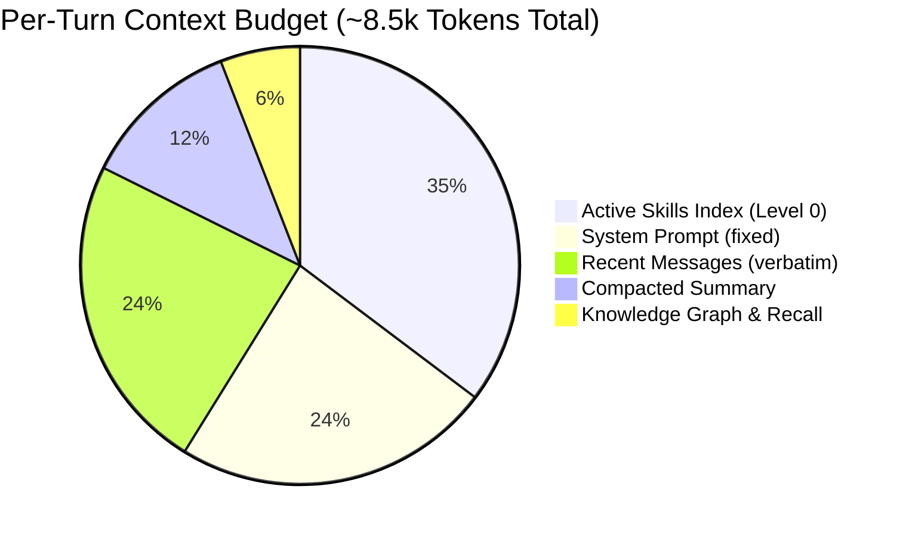
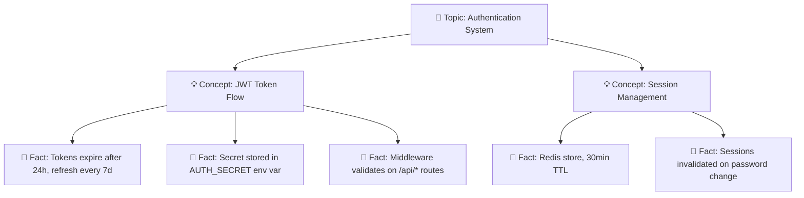

# Token Efficiency & Hybrid Search

GAIA uses a **Knowledge Graph + FTS5 & Vector Hybrid Search** to recall only relevant context per turn, saving **70%+ tokens** on long sessions compared to traditional agent prompt replay.

---

## The Problem

Traditional agents replay the **entire conversation history** every turn, creating exponential token cost growth:

| Session Length | Traditional Agent | GAIA (Fixed Budget) |
|---|---|---|
| **10 messages** | ~5k tokens | ~8.5k tokens |
| **50 messages** | ~25k tokens | ~8.5k tokens |
| **100 messages** | ~50k tokens | ~8.5k tokens |
| **500 messages** | ~200k+ tokens *(overflow / crash)* | **~8.5k tokens** |

At 500 messages, traditional agents overflow their context windows. GAIA stays within a strict, predictable budget per turn.

---

## Per-Turn Context Budget

---

## Context Optimization Mechanisms

### 1. Hybrid Search (FTS5 + Vector Embeddings)

- **Cost**: `0 LLM Tokens` (Executed locally via SQLite)  
- **Benefit**: Precise context extraction without expensive filtering LLM calls.

GAIA combines **SQLite FTS5 full-text keyword search** with **semantic vector embeddings** to retrieve historical facts, decisions, and codebase observations. This hybrid approach guarantees that relevant memories are retrieved even if exact keywords differ, without consuming LLM budget for context discovery.

### 2. Knowledge Graph Recall

- **Cost**: `~500 tokens` per turn  
- **Saving**: Scales context efficiency on long-running sessions.

Before each turn, GAIA:
1. Extracts active concepts from the user message.
2. Queries the Knowledge Graph using hybrid search.
3. Injects relevant semantic facts directly into the system prompt.

### 3. Context Compaction

- **Cost**: `~1k tokens` per turn (on compaction execution)  
- **Saving**: Caps prompt size permanently on long sessions.

When conversation length crosses the compaction threshold (default: 50 messages):
1. Older messages are summarized into a structured executive summary.
2. Only the last 5 messages are kept verbatim.
3. The compacted summary replaces raw message history in context.

### 4. Progressive Skill Loading

- **Cost**: `~3k tokens` (Level 0 index)  
- **Saving**: Prevents loading unused instructions into memory.

- **Level 0** (always in context): Short skill manifests `[{name, description, tags}]` (~3k tokens).
- **Level 1** (on demand): Full `SKILL.md` content loaded only when triggered.
- **Level 2** (on demand): Specific reference files.

---

## Knowledge Graph Structure

Each fact contains:
- **Labels**: Semantic tags.
- **Summary**: Concise description.
- **FTS5 Index**: Fast keyword lookup.
- **Embedding Vector**: Dense vector representation for semantic similarity.

---

## Token Budget Per Subagent

Subagents operate under isolated token budgets. When a subagent's token budget approaches its threshold:
1. The subagent automatically summarizes its working memory.
2. Only terminal artifacts (e.g. `proposal.md`, `spec.md`, `design.md`) are returned to the parent session.
3. Intermediate reasoning traces are discarded, preventing context pollution.
