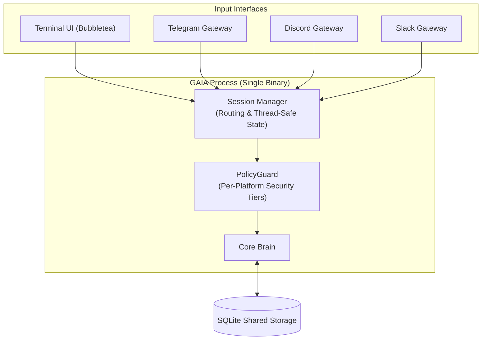

# Unified Architecture: TUI + Gateway

This document describes the unified architecture of GAIA, integrating the Terminal User Interface (TUI) and Gateway services into a single process with multi-platform session routing.

---

## 1. Overview

Traditionally, AI agent interfaces either run exclusively in a local CLI/TUI or operate as a headless gateway bot (Telegram, Discord, Slack). GAIA unifies both paradigms into a **single binary** sharing a core `Brain` instance, shared SQLite persistence, and a centralized `SessionManager`.

---

## 2. System Architecture



---

## 3. Session Manager

### 3.1 Concept

The `SessionManager` routes incoming messages from any interface to the appropriate conversation context. It supports three distinct modes depending on user preference.

### 3.2 Operating Modes

#### Mode: `unify` (Default)
A single global conversation context. All messages across all platforms feed into the same active session.

```text
TUI:      "refactor auth module to JWT"
Telegram: "remember to check tests"

History:
  [tui] refactor auth module to JWT
  [telegram] remember to check tests
```

#### Mode: `isolate`
Each platform maintains its own independent session context.

```text
TUI:      "refactor auth module to JWT" → Session "tui-default"
Telegram: "remember to check tests"    → Session "telegram-default"
```

#### Mode: `ask` (Smart Prompt)
When a message arrives from a different platform than the currently active one, GAIA prompts the user in the active UI to decide whether to merge or isolate the session.

---

## 3.3 Thread-Safe Implementation

The `SessionManager` utilizes read/write mutexes to guarantee thread-safety across concurrent gateway events, along with sanitization to prevent platform prefix spoofing.

```go
type SessionMode string

const (
    SessionUnify   SessionMode = "unify"
    SessionIsolate SessionMode = "isolate"
    SessionAsk     SessionMode = "ask"
)

type SessionManager struct {
    mu          sync.RWMutex
    mode        SessionMode
    activeID    string
    platformIDs map[string]string // platform -> sessionID
    brain       *Brain
}

func (sm *SessionManager) Route(ctx context.Context, platform string, content string) error {
    sm.mu.Lock()
    defer sm.mu.Unlock()

    // Sanitize user content to prevent prefix spoofing
    cleanContent := sanitizePlatformPrefix(content)

    switch sm.mode {
    case SessionUnify:
        formatted := fmt.Sprintf("[%s] %s", platform, cleanContent)
        return sm.brain.ProcessMessage(ctx, formatted)

    case SessionIsolate:
        sessID, ok := sm.platformIDs[platform]
        if !ok {
            sessID = sm.createSessionLocked(platform)
            sm.platformIDs[platform] = sessID
        }
        return sm.brain.ProcessMessageForSession(ctx, sessID, cleanContent)

    case SessionAsk:
        if sm.activeID != "" && sm.lastPlatform != platform {
            return sm.promptUserLocked(platform, cleanContent)
        }
        return sm.brain.ProcessMessage(ctx, cleanContent)
    }

    return nil
}

func sanitizePlatformPrefix(input string) string {
    // Strip leading synthetic platform tags if injected by user
    return strings.TrimLeft(input, " \t\r\n")
}
```

---

## 4. PolicyGuard Integration

PolicyGuard enforces granular security tiers per platform interface:

```yaml
policy:
  platforms:
    tui:
      tier: full        # Unrestricted execution
    telegram:
      tier: sandbox     # Restricted to workspace directory
    discord:
      tier: read        # Read-only inspection
```

---

## 5. Current Architecture Status

The unified architecture is **fully implemented** in GAIA:
- Running `gaia` launches the TUI along with configured gateway listeners in a single process.
- Background goroutines handle gateway events cleanly without blocking the interactive Bubbletea UI loop.
- `SessionManager` manages cross-platform routing dynamically.
